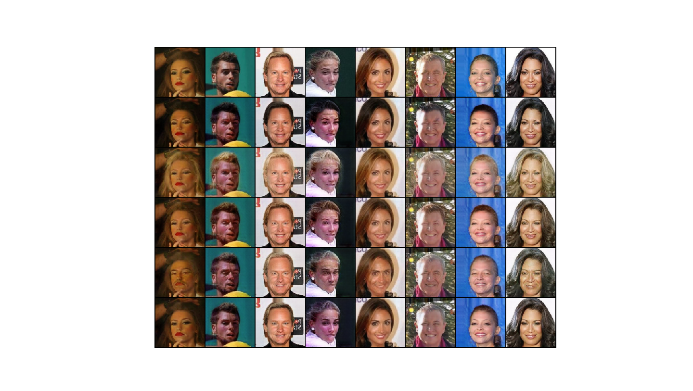
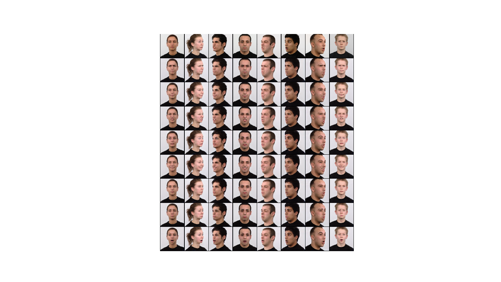

# StarGAN

#### Title
[StarGAN: Unified Generative Adversarial Networks for Multi-Domain Image-to-Image Translation](https://arxiv.org/abs/1711.09020)

#### Abstract
Recent studies have shown remarkable success in image-to-image translation for two domains. However, existing approaches have limited scalability and robustness in handling more than two domains, since different models should be built independently for every pair of image domains. To address this limitation, we propose StarGAN, a novel and scalable approach that can perform image-to-image translations for multiple domains using only a single model. Such a unified model architecture of StarGAN allows simultaneous training of multiple datasets with different domains within a single network. This leads to StarGAN's superior quality of translated images compared to existing models as well as the novel capability of flexibly translating an input image to any desired target domain. We empirically demonstrate the effectiveness of our approach on a facial attribute transfer and a facial expression synthesis tasks.

        
## Train
    $ python main.py --mode train \
                     --scope [scope name] \
                     --name_data [data name] \
                     --dir_data [data directory] \
                     --dir_log [log directory] \
                     --dir_checkpoint [checkpoint directory] \
                     --ny_load [size y of center crop] \
                     --nx_load [size x of center crop] \
                     --selected_attrs [attributes type]  
---
    $ python main.py --mode train \
                     --scope stargan \
                     --name_data celeba \
                     --dir_data ./datasets \
                     --dir_log ./log \
                     --dir_checkpoint ./checkpoint \
                     --ny_load 178 \
                     --nx_load 178 \
                     --selected_attrs Black_Hair Blond_Hair Brown_Hair Male Young                                  
---
    $ python main.py --mode train \
                     --scope stargan \
                     --name_data rafd \
                     --dir_data ./datasets \
                     --dir_log ./log \
                     --dir_checkpoint ./checkpoint \
                     --ny_load 640 \
                     --nx_load 640 \
                     --selected_attrs angry contemptuous disgusted fearful happy neutral sad surprised

* Set **[scope name]** uniquely.
* Hyperparameters were written to **arg.txt** under the **[log directory]**.
* To understand hierarchy of directories based on their arguments, see **directories structure** below. 

## Test
    $ python main.py --mode test \
                     --scope [scope name] \
                     --name_data [data name] \
                     --dir_data [data directory] \
                     --dir_log [log directory] \
                     --dir_checkpoint [checkpoint directory] \
                     --ny_load [size y of center crop] \
                     --nx_load [size x of center crop] \
                     --selected_attrs [attributes type] \
                     --dir_result [result directory]                     
---
    $ python main.py --mode test \
                     --scope pix2pix \
                     --name_data facades \
                     --dir_data ./datasets \
                     --dir_log ./log \
                     --dir_checkpoint ./checkpoints \
                     --ny_load 178 \
                     --nx_load 178 \
                     --selected_attrs Black_Hair Blond_Hair Brown_Hair Male Young \
                     --dir_result ./results
---
    $ python main.py --mode test \
                     --scope pix2pix \
                     --name_data facades \
                     --dir_data ./datasets \
                     --dir_log ./log \
                     --dir_checkpoint ./checkpoints \
                     --ny_load 640 \
                     --nx_load 640 \
                     --selected_attrs angry contemptuous disgusted fearful happy neutral sad surprised \
                     --dir_result ./results
                     
* To test using trained network, set **[scope name]** defined in the **train** phase.
* Generated images are saved in the **images** subfolder along with **[result directory]** folder.
* **index.html** is also generated to display the generated images.  

## Tensorboard
    $ tensorboard --logdir [log directory]/[scope name]/[data name] \
                  --port [(optional) 4 digit port number]
---
    $ tensorboard --logdir ./log/cyclegan/celeba \
                  --port 6006
---
    $ tensorboard --logdir ./log/cyclegan/rafd \
                  --port 6006
                                    
After the above comment executes, go **http://localhost:6006**

* You can change **[(optional) 4 digit port number]**.
* Default 4 digit port number is **6006**.

## Results

    1st row: input
    2nd row: black hair (domain A)
    3rd row: blond hair (domain B)
    4th row: brown hair (domain C)
    5th row: male (domain D)
    6th row: young (domain E)

* The results were generated by a network trained with **celeba** dataset during **16 epochs**.
* After the Test phase runs, execute **display_result.py** to display the figure.

    1st row: input
    2nd row: angry (domain A)
    3rd row: contemptuous (domain B)
    4th row: disgusted (domain C)
    5th row: fearful (domain D)
    6th row: happy (domain E)
    7th row: neutral (domain F)
    8th row: sad (domain G)
    9th row: surprised (domain H)
    
* The results were generated by a network trained with **rafd** dataset during **140 epochs**.
* After the Test phase runs, execute **display_result.py** to display the figure.

## Directories structure
    pytorch-StarGAN
    +---[dir_checkpoint]
    |   \---[scope]
    |       \---[name_data]
    |           +---model_epoch00000.pth
    |           |   ...
    |           \---model_epoch12345.pth
    +---[dir_data]
    |   \---[name_data]
    |       +---00000.png
    |       |   ...
    |       \---12345.png
    +---[dir_log]
    |   \---[scope]
    |       \---[name_data]
    |           +---arg.txt
    |           \---events.out.tfevents
    \---[dir_result]
        \---[scope]
            \---[name_data]
                +---images
                |   +---00000-input.png
                |   +---00000-output-att0.png
                |   |   ...
                |   +---00000-output-attN.png
                |   |   ...
                |   +---12345-input.png
                |   +---12345-output-att0.png
                |   |   ...
                |   +---12345-output-attN.png
                \---index.html

---

    pytorch-StarGAN
    +---checkpoints
    |   \---stargan
    |       +---celeba
    |       |   +---model_epoch0000.pth
    |       |   |   ...
    |       |   \---model_epoch0016.pth
    |       \---rafd
    |           +---model_epoch0000.pth
    |           |   ...
    |           \---model_epoch0140.pth
    +---datasets
    |   +---celeba
    |   |   +---000001.jpg
    |   |   |   ...
    |   |   \---202599.jpg
    |   \---rafd
    |       +---Rafd000_01_Caucasian_female_angry_frontal.jpg
    |       |   ...
    |       \---Rafd180_73_Moroccan_male_surprised_right.jpg
    +---log
    |   \---stargan
    |       +---celeba
    |       |   +---arg.txt
    |       |   \---events.out.tfevents
    |       \---rafd
    |           +---arg.txt
    |           \---events.out.tfevents
    \---results
        \---stargan
            +---celeba
            |   +---images
            |   |   +---0001-input.png
            |   |   +---0001-output-Black_Hair.png
            |   |   +---0001-output-Blond_Hair.png
            |   |   +---0001-output-Male.png
            |   |   +---0001-output-Young.png
            |   |   |   ...
            |   |   +---2000-input.png
            |   |   +---2000-output-Black_Hair.png
            |   |   +---2000-output-Blond_Hair.png
            |   |   +---2000-output-Male.png
            |   |   +---2000-output-Young.png
            |   \---index.html
            \---rafd
                +---images
                |   +---0001-input.png
                |   +---0001-output-angry.png
                |   +---0001-output-contemptuous.png
                |   +---0001-output-disgusted.png
                |   +---0001-output-fearful.png
                |   +---0001-output-happy.png
                |   +---0001-output-neutral.png
                |   +---0001-output-sad.png
                |   +---0001-output-surprised.png
                |   |   ...
                |   +---2000-input.png
                |   +---2000-output-angry.png
                |   +---2000-output-contemptuous.png
                |   +---2000-output-disgusted.png
                |   +---2000-output-fearful.png
                |   +---2000-output-happy.png
                |   +---2000-output-neutral.png
                |   +---2000-output-sad.png
                |   +---2000-output-surprised.png
                \---index.html 
                
* Above directory is created by setting arguments when **main.py** is executed.               
